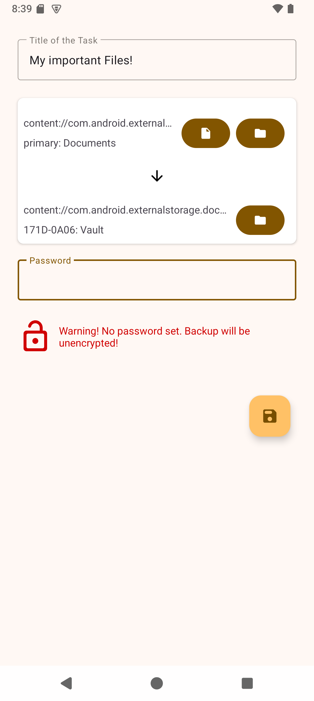

# Usb Backup - Auto-Backup your files to removable Storage!
[](https://github.com/newhinton/UsbBackup/blob/master/LICENSE) [](https://github.com/newhinton/UsbBackup/releases) [](https://github.com/newhinton/UsbBackup/releases/latest)

[](https://github.com/newhinton/UsbBackup/actions/workflows/lint.yml)

A small app that allows you to quickly back up important files to thumb-drives!


## Screenshots
<table>
  <tr style="border:none">
    <td style="border:none">
      
    </td>
    <td style="border:none">
      
    </td>
  </tr>
</table>


## Features

- **Automation** Automatically start backups! 
- **Integration** Use any Cloud Provider on your phone as a source!
- **Material 3 Design** (Dark theme)
- **AES Encryption** Encrypt your files on your drive. WARNING: ENCRYPTION CODE NOT AUDITED
- **PC Decryption Tool** When backing up, we create a decryption tool that you can use on any pc to open your backups! 


## Installation

Grab the [latest version](https://github.com/newhinton/UsbBackup/releases/latest) of the signed APK and install it on your phone.

## Usage


## Libraries
- [rclone](https://github.com/rclone/rclone) - Calling this a library is an understatement. Without rclone, there would not be Round Sync. See https://rclone.org/donate/ to support rclone.
- [Jetpack AndroidX](https://developer.android.com/license)
- [Floating Action Button SpeedDial](https://github.com/leinardi/FloatingActionButtonSpeedDial) - A Floating Action Button Speed Dial implementation for Android that follows the Material Design specification.
- [Glide](https://github.com/bumptech/glide) - An image loading and caching library for Android focused on smooth scrolling.
- [MarkdownJ](https://github.com/myabc/markdownj) - converts markdown into HTML.
- [Material Design Icons](https://github.com/Templarian/MaterialDesign) - 2200+ Material Design Icons from the Community.
- [Recyclerview Animators](https://github.com/wasabeef/recyclerview-animators) - An Android Animation library which easily add itemanimator to RecyclerView items.
- [Toasty](https://github.com/GrenderG/Toasty) - The usual Toast, but with steroids.
- Icons from [Flaticon](https://www.flaticon.com) courtesy of [Smashicons](https://www.flaticon.com/authors/smashicons) and [Freepik](https://www.flaticon.com/authors/freepik)


## Contributing
See [CONTRIBUTING](./CONTRIBUTING.md)

Anyone is welcome to contribute and help out. However, hate, discrimination and racism are decidedly unwelcome here. If you feel offended by this, you might belong to the group of people who are not welcome. I will not tolerate hate in any way.


## Developing

You should first make sure you have:
- Java installed and in your PATH
- Android SDK command-line tools installed

You can then build the app normally from Android Studio or from CLI by running:

```sh
# Debug build
./gradlew assembleDebug

# or release build
./gradlew assembleRelease
```

The desktop-app can be build with:


```sh
./gradlew jar

```

## Todo:

- Option to switch between usb-detection modes
- file support
- folder/filepicker selector popup
- in-app-decryption of files

## License
This app is released under the terms of the [GPLv3 license](https://github.com/newhinton/usbbackup/blob/master/LICENSE).